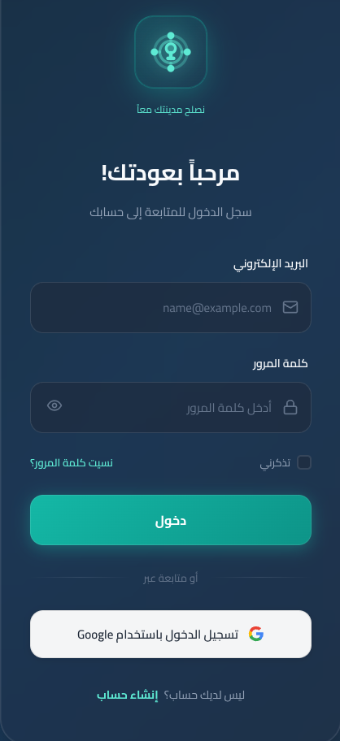
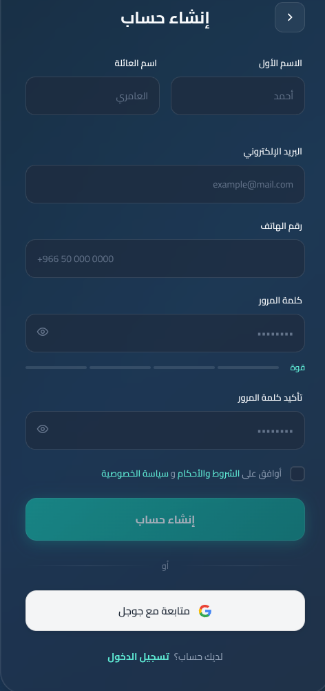

# 🏙 City Fix – Taiz

A mobile application built with **Flutter** that allows citizens in Taiz City to report public service issues directly to the responsible authorities.

The application helps improve communication between citizens and local service providers by allowing users to report issues such as water problems, waste management, and road damage.

---

# 📱 App Screenshots

| Log_in Screen                      | create_account Screan                        |
| -------------------------------- | ------------------------------- |
|  |  |

---

# 🎯 Project Goal

The goal of this project is to create a digital platform that helps citizens report infrastructure and service problems in Taiz quickly and efficiently.

Citizens can submit reports, attach images, and specify the location of the issue on the map so the relevant authorities can respond faster.

---

# ⚙ Features

* 📍 Report service issues with location
* 🗺 Display issues on an interactive map
* 📷 Attach photos of the problem
* 📝 Add descriptions for each report
* 🔎 Track reported issues
* 📱 Simple and user-friendly interface

---

# 🏗 Types of Issues Supported

* 💧 Water supply problems
* 🧹 Waste and sanitation issues
* 🛣 Road damage and potholes
* 🚧 Public works problems
* 🏙 Other municipal service issues

---

# 🧰 Tech Stack

* Flutter
* Dart
* OpenStreetMap
* REST API
* Git & GitHub

---

# 📂 Project Structure

sawtak_app/
│
├── 📄 pubspec.yaml                   
├── 📄 analysis_options.yaml        
├── 📄 README.md                       
│
├── 📁 android/                      
│   ├── 📁 app/
│   │   ├── 📄 build.gradle
│   │   └── 📁 src/main/
│   │       ├── 📄 AndroidManifest.xml
│   │       └── 📁 kotlin/
│   │
├── 📁 ios/                           
│
├── 📁 assets/                        
│   ├── 📁 images/
│   │   ├── 📄 logo.png
│   │   ├── 📄 onboarding_1.png
│   │   ├── 📄 onboarding_2.png
│   │   └── 📄 onboarding_3.png
│   ├── 📁 icons/
│   │   ├── 📄 app_icon.png
│   │   └── 📄 splash_icon.png
│   ├── 📁 fonts/
│   │   ├── 📄 Tajawal-Regular.ttf
│   │   ├── 📄 Tajawal-Medium.ttf
│   │   ├── 📄 Tajawal-SemiBold.ttf
│   │   └── 📄 Tajawal-Bold.ttf
│   └── 📁 translations/
│       ├── 📄 ar.json                
│       └── 📄 en.json                
├── 📁 lib/                            
│   ├── 📄 main.dart                  
│   │
│   ├── 📁 core/                    
│   │   ├── 📁 constants/
│   │   │   ├── 📄 app_constants.dart        
│   │   │   ├── 📄 api_constants.dart        
│   │   │   ├── 📄 asset_constants.dart     
│   │   │   └── 📄 route_constants.dart     
│   │   │
│   │   ├── 📁 theme/
│   │   │   ├── 📄 app_theme.dart            
│   │   │   ├── 📄 app_colors.dart           
│   │   │   ├── 📄 app_typography.dart     
│   │   │   └── 📄 app_dimensions.dart       
│   │   │
│   │   ├── 📁 utils/	
│   │   │   ├── 📄 validators.dart           
│   │   │   ├── 📄 formatters.dart          
│   │   │   ├── 📄 extensions.dart          
│   │   │   └── 📄 helpers.dart             
│   │   │
│   │   ├── 📁 errors/
│   │   │   ├── 📄 exceptions.dart          
│   │   │   └── 📄 failures.dart             
│   │   │
│   │   └── 📁 network/
│   │       ├── 📄 api_client.dart           
│   │       ├── 📄 network_info.dart        
│   │       └── 📄 api_interceptors.dart     
│   │
│   ├── 📁 data/                       # Data Layer
│   │   ├── 📁 models/
│   │   │   ├── 📄 user_model.dart
│   │   │   ├── 📄 report_model.dart
│   │   │   ├── 📄 notification_model.dart
│   │   │   ├── 📄 stats_model.dart
│   │   │   ├── 📄 badge_model.dart
│   │   │   └── 📄 settings_model.dart
│   │   │
│   │   ├── 📁 repositories/
│   │   │   ├── 📄 auth_repository_impl.dart
│   │   │   ├── 📄 report_repository_impl.dart
│   │   │   ├── 📄 notification_repository_impl.dart
│   │   │   ├── 📄 user_repository_impl.dart
│   │   │   └── 📄 settings_repository_impl.dart
│   │   │
│   │   ├── 📁 services/
│   │   │   ├── 📄 auth_service.dart
│   │   │   ├── 📄 report_service.dart
│   │   │   ├── 📄 notification_service.dart
│   │   │   ├── 📄 user_service.dart
│   │   │   ├── 📄 location_service.dart
│   │   │   ├── 📄 image_picker_service.dart
│   │   │   └── 📄 push_notification_service.dart
│   │   │
│   │   └── 📁 local/
│   │       ├── 📄 local_storage.dart         
│   │       ├── 📄 cache_manager.dart          
│   │       └── 📄 database_helper.dart       
│   │
│   ├── 📁 domain/                
│   │   ├── 📁 entities/
│   │   │   ├── 📄 user.dart
│   │   │   ├── 📄 report.dart
│   │   │   ├── 📄 notification.dart
│   │   │   ├── 📄 stats.dart
│   │   │   ├── 📄 badge.dart
│   │   │   └── 📄 settings.dart
│   │   │
│   │   ├── 📁 repositories/
│   │   │   ├── 📄 auth_repos  itory.dart
│   │   │   ├── 📄 report_repository.dart
│   │   │   ├── 📄 notification_repository.dart
│   │   │   ├── 📄 user_repository.dart
│   │   │   └── 📄 settings_repository.dart
│   │   │
│   │   └── 📁 use_cases/
│   │       ├── 📁 auth/
│   │       │   ├── 📄 login_use_case.dart
│   │       │   ├── 📄 register_use_case.dart
│   │       │   ├── 📄 logout_use_case.dart
│   │       │   ├── 📄 verify_otp_use_case.dart
│   │       │   └── 📄 reset_password_use_case.dart
│   │       │
│   │       ├── 📁 reports/
│   │       │   ├── 📄 get_reports_use_case.dart
│   │       │   ├── 📄 create_report_use_case.dart
│   │       │   ├── 📄 update_report_use_case.dart
│   │       │   ├── 📄 delete_report_use_case.dart
│   │       │   └── 📄 get_report_details_use_case.dart
│   │       │
│   │       ├── 📁 notifications/
│   │       │   ├── 📄 get_notifications_use_case.dart
│   │       │   ├── 📄 mark_notification_read_use_case.dart
│   │       │   └── 📄 clear_all_notifications_use_case.dart
│   │       │
│   │       └── 📁 user/
│   │           ├── 📄 get_user_profile_use_case.dart
│   │           ├── 📄 update_user_profile_use_case.dart
│   │           └── 📄 get_user_stats_use_case.dart
│   │
│   ├── 📁 presentation/             
│   │   ├── 📁 providers/             
│   │   │   ├── 📄 auth_provider.dart
│   │   │   ├── 📄 report_provider.dart
│   │   │   ├── 📄 notification_provider.dart
│   │   │   ├── 📄 user_provider.dart
│   │   │   ├── 📄 settings_provider.dart
│   │   │   └── 📄 theme_provider.dart
│   │   │
│   │   ├── 📁 screens/                # All Screens
│   │   │   ├── 📁 auth/
│   │   │   │   ├── 📄 onboarding_screen.dart
│   │   │   │   ├── 📄 login_screen.dart
│   │   │   │   ├── 📄 signup_screen.dart
│   │   │   │   ├── 📄 otp_verification_screen.dart
│   │   │   │   └── 📄 forgot_password_screen.dart
│   │   │   │
│   │   │   ├── 📁 home/
│   │   │   │   ├── 📄 home_screen.dart
│   │   │   │   └── 📄 home_widgets.dart
│   │   │   │
│   │   │   ├── 📁 reports/
│   │   │   │   ├── 📄 create_report_screen.dart
│   │   │   │   ├── 📄 my_reports_screen.dart
│   │   │   │   ├── 📄 report_details_screen.dart
│   │   │   │   └── 📄 report_widgets.dart
│   │   │   │
│   │   │   ├── 📁 map/
│   │   │   │   ├── 📄 map_screen.dart
│   │   │   │   └── 📄 map_widgets.dart
│   │   │   │
│   │   │   ├── 📁 notifications/
│   │   │   │   ├── 📄 notifications_screen.dart
│   │   │   │   └── 📄 notification_widgets.dart
│   │   │   │
│   │   │   ├── 📁 profile/
│   │   │   │   ├── 📄 profile_screen.dart
│   │   │   │   ├── 📄 edit_profile_screen.dart
│   │   │   │   └── 📄 profile_widgets.dart
│   │   │   │
│   │   │   ├── 📁 settings/
│   │   │   │   ├── 📄 settings_screen.dart
│   │   │   │   ├── 📄 language_settings_screen.dart
│   │   │   │   ├── 📄 notification_settings_screen.dart
│   │   │   │   ├── 📄 privacy_settings_screen.dart
│   │   │   │   └── 📄 about_screen.dart
│   │   │   │
│   │   │   └── 📄 splash_screen.dart
│   │   │
│   │   ├── 📁 widgets/                
│   │   │   ├── 📁 common/
│   │   │   │   ├── 📄 app_button.dart
│   │   │   │   ├── 📄 app_text_field.dart
│   │   │   │   ├── 📄 app_app_bar.dart
│   │   │   │   ├── 📄 app_bottom_nav.dart
│   │   │   │   ├── 📄 app_drawer.dart
│   │   │   │   ├── 📄 app_loading.dart
│   │   │   │   ├── 📄 app_error.dart
│   │   │   │   ├── 📄 app_empty_state.dart
│   │   │   │   ├── 📄 app_toast.dart
│   │   │   │   ├── 📄 app_dialog.dart
│   │   │   │   └── 📄 app_status_pill.dart
│   │   │   │
│   │   │   ├── 📁 cards/
│   │   │   │   ├── 📄 report_card.dart
│   │   │   │   ├── 📄 notification_card.dart
│   │   │   │   ├── 📄 stats_card.dart
│   │   │   │   ├── 📄 badge_card.dart
│   │   │   │   └── 📄 kpi_card.dart
│   │   │   │
│   │   │   └── 📁 forms/
│   │   │       ├── 📄 image_picker_field.dart
│   │   │       ├── 📄 location_picker_field.dart
│   │   │       ├── 📄 category_dropdown.dart
│   │   │       └── 📄 rating_bar.dart
│   │   │
│   │   └── 📁 routing/              
│   │       ├── 📄 app_router.dart
│   │       └── 📄 route_guard.dart
│   │
│   └── 📁 di/                        
│       └── 📄 injection_container.dart
│
├── 📁 test/                          
│   ├── 📁 unit/
│   │   ├── 📁 data/
│   │   ├── 📁 domain/
│   │   └── 📁 presentation/
│   │
│   └── 📁 widget/
│       ├── 📁 screens/
│       └── 📁 widgets/
│
└── 📁 integration_test/               
    └── 📄 app_test.dart

---

# 🚀 Installation

Clone the repository:

git clone https://github.com/odaifaiz/Osmex-Tech_project1.git

Navigate to the project folder:

cd Osmex-Tech_project1

Install dependencies:

flutter pub get

Run the application:

flutter run

---

# 👨‍💻 Author

Odai Faez
Saameh Mohammed

GitHub:
https://github.com/odaifaiz

---

# 📌 Future Improvements

* User authentication
* Notifications for issue status updates
* Admin dashboard for authorities
* Issue tracking system

---

# ⭐ Support

If you find this project useful, please give it a **star on GitHub**.
